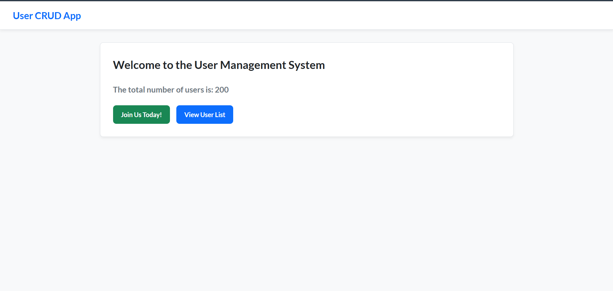
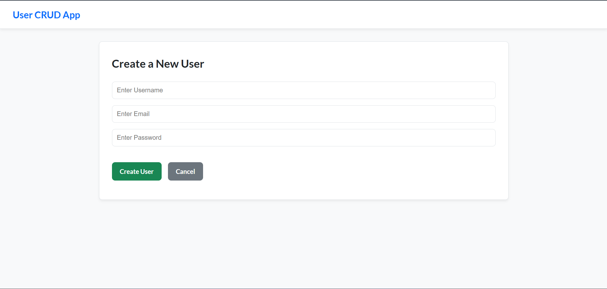
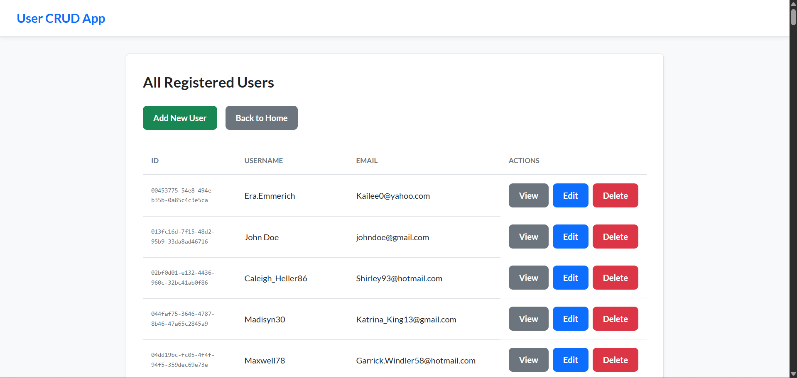
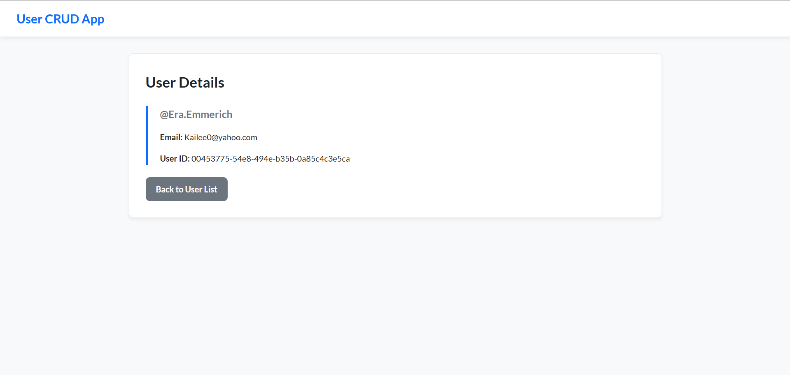
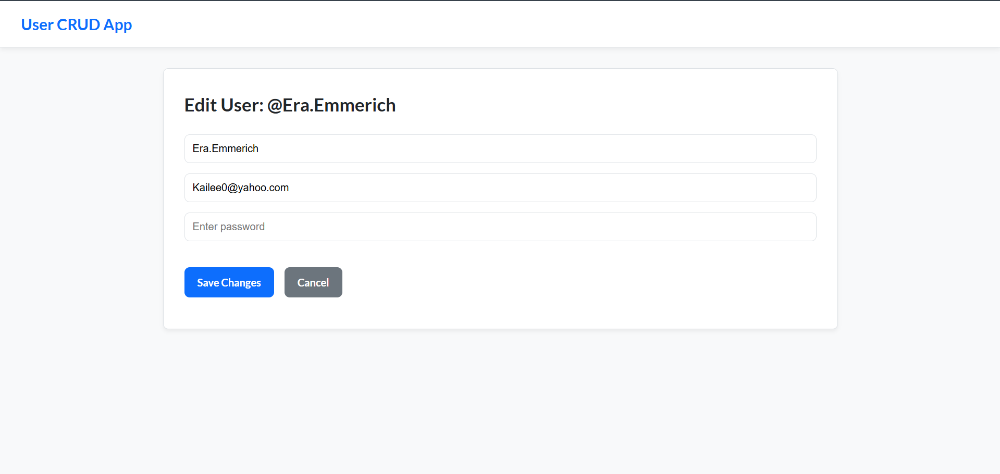
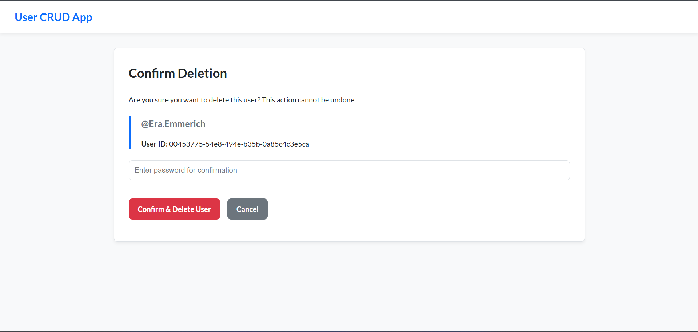

# Node.js, Express & MySQL CRUD Practice

A hands-on project created to learn and demonstrate the fundamentals of backend development. This application showcases the integration of a Node.js/Express server with a MySQL database to perform full CRUD operations on user data. It serves as a practical exercise in building a dynamic web application from the server-side up.

## Core Concepts Demonstrated

This project was built to practice and showcase a solid understanding of the following backend concepts:

- **Server-Side Routing**: Implementing a full suite of routes using Express.js to handle different HTTP methods (GET, POST, PATCH, DELETE).
- **Database Integration**: Connecting a Node.js application to a MySQL database, performing queries to create, read, update, and delete records.
- **Dynamic Templating**: Using EJS (Embedded JavaScript) to dynamically render HTML pages with data fetched from the database.
- **Middleware**: Utilizing Express middleware for handling URL-encoded form data (`express.urlencoded`) and overriding HTTP methods (`method-override`).
- **Environment Variables**: Securing sensitive information like database credentials by storing them in a `.env` file and accessing them via `process.env`.
- **Database Seeding**: Using a separate script (`seed.js`) to populate the database with fake data for development and testing purposes.

## Technology Stack

- **Backend**: Node.js, Express.js
- **Database**: MySQL
- **Templating Engine**: EJS (Embedded JavaScript)
- **Development Tools**: Faker.js (for data generation), dotenv (for environment variables)

## Screenshots

_1. The main page, listing total number of users._


_2. The 'Create New User' page with its form fields._


_3. The 'View Users' page showing all users._


_4. The 'View User' page showing a single user in detail._


_5. The 'Update User' page, allowing users to update their details._


_d. The 'Delete User' page, allowing users to delete their details._


## Setup and Installation

To run this project locally, follow these steps:

#### 1. Clone the repository:

```bash
git clone [https://github.com/RutvijDev/nodejs-express-mysql-crud-practice.git](https://github.com/RutvijDev/nodejs-express-mysql-crud-practice.git)
```

#### 2. Install dependencies:

```bash
npm install
```

#### 3. Set up the database::

- Make sure you have MySQL installed and running on your machine.

- Create a new database. The default name used in this project is demo.

#### 4. Set up environment variables:

- Create a new file named .env in the root of the project.

- Copy the contents of .env.example (if provided) or add the following variables, replacing the values with your own MySQL credentials:

```bash
DB_HOST=localhost

DB_USER=root

DB_PASSWORD=your_mysql_password

DB_NAME=demo

PORT=8080
```

#### 5. Seed the database (Optional):

- To populate the database with 100 fake users, run the command in terminal:

```bash
node seed.js
```

## Usage

Once the setup is complete, you can start the Express server with the following command:

```bash
node index.js
```

The application will be running on http://localhost:8080.
